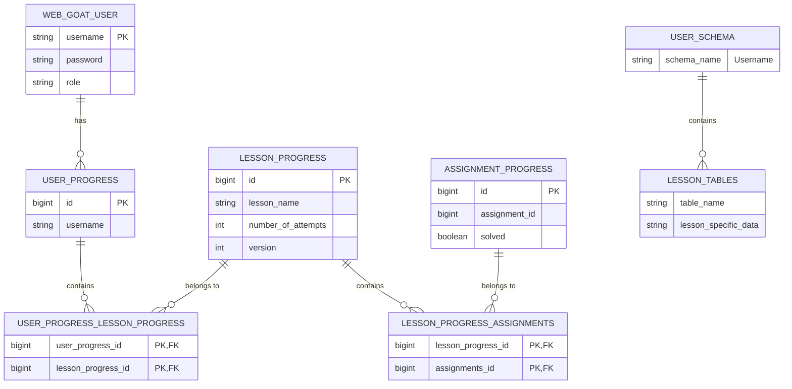

# WebGoat User Database Schema Diagram

The following diagram illustrates the database schema for user management in WebGoat.

## Schema Explanation

1. **WEB_GOAT_USER**: Stores user credentials and roles
2. **USER_PROGRESS**: Tracks overall progress for each user
3. **LESSON_PROGRESS**: Tracks progress for specific lessons
4. **ASSIGNMENT_PROGRESS**: Tracks completion status of individual assignments
5. **Relationship Tables**: Connect users to lessons and assignments
6. **User-specific Schema**: Each user gets their own schema with lesson-specific tables

All tables except the user-specific lesson tables are in the CONTAINER schema. 